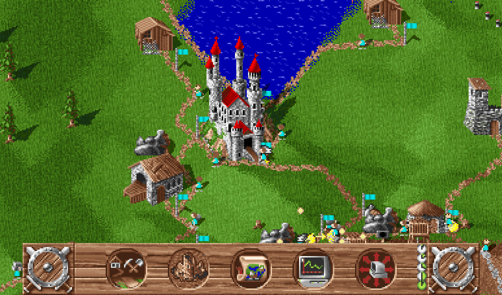
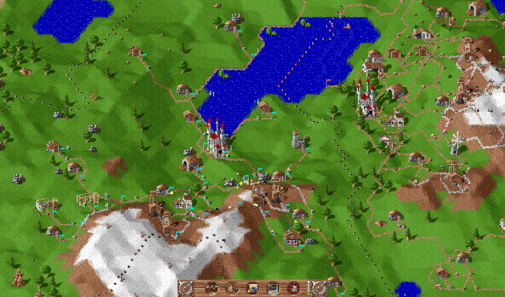

# webserf

A port of “The Settlers” (Blue Byte, 1993) in the browser.

The rules are ported from the original DOS program — its own machine code is the reference, not somebody's description of it. The graphics, sounds and music are read straight from your own copy of the game files.

## Play it

**<https://www.webserf.org>** — open the page, drop in the graphics archive (`SPA*.PA`) from any 1993 installation you own, and you are in the game. Your archive and your saved games stay in your browser; nothing is uploaded, and there is no account.

Nothing of the original is bundled here, so the file has to come from you.

## Features

- **Zoom, in a window of any size** — mouse wheel, touchpad or two fingers, from the whole world in one frame up to eight times pixel size.
- **Mouse or touch** — place, pull, push-scroll and the special click; on a tablet two fingers pan and zoom, and a long press stands in for the special click.
- **Speed and pause** — 0.25× to 8×; only the ticks per second of real time change, so a game stays reproducible at any of them.
- **Ten saved-game slots** — kept in this browser, and optionally mirrored into a folder as real `ARCHIV.DS` / `SAVE0..9.DS` files, which the original reads as they are. Import and export as a single file or a package.
- **Sound and music** — the effects and the FM-synth soundtrack, read from your archive.
- **German and English** — the game texts follow your archive, the frame around them follows your browser.
- **Installable, and it runs offline** — install it from the browser; archive and saved games are already local.
- **Screenshot and video** — a picture of the game screen, or a recording of it with the pointer.
- **Bug reports in one click** — game state, action log, screenshot and a summary, packed and ready to attach to an issue.
- **Levels, missions, free play** — campaign levels with their passwords, or a free game from a map seed code against computer opponents.

| the map up close | pulled back |
|---|---|
|  |  |

Click either picture for the full size.

## Thank you

To **Volker Wertich**, for designing the thing in the first place. Thirty years on, the economy still hums.

## How it was made

Built together with Claude Code — a collaboration between a human and a language model. 🤓

## Legal

“The Settlers” and everything in it belong to Blue Byte / Ubisoft. This is an independent hobby project with no connection to them — built out of admiration, and out of a slight inability to let 1993 go. No original game data is contained in this repository, and none is distributed with the application.
